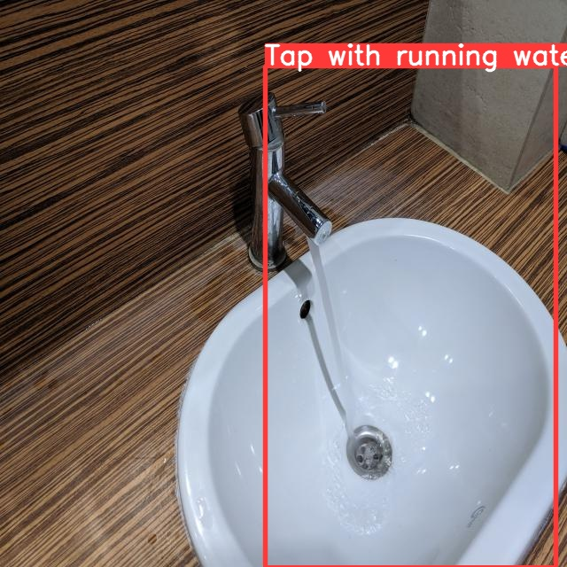

# YOLO, so Save Water

A performance comparison of the three state-of-the-art object detection models in their smallest forms: [_YOLOv4 Tiny_](https://github.com/AlexeyAB/darknet), [_YOLOv5 Nano_](https://github.com/ultralytics/yolov5), [_Mask R-CNN_](https://github.com/matterport/Mask_RCNN).

The task is to detect taps in a photo and classify them based on whether the water is running or not.

## Code

There are three Jupyter notebooks, one for each model. Inside you can find a detailed description of the training process and evaluation. Follow the links below to open clean source files of notebooks or click the **Open in Colab** badges to open the files with saved outputs. Alternatively, files with outputs can be found in the **Releases** section.

* YOLOv4 – [`notebooks/yolov4-tiny.ipynb`](./notebooks/yolov4-tiny.ipynb)

  

* YOLOv5 – [`notebooks/yolov5-nano.ipynb`](./notebooks/yolov5-nano.ipynb)

  

* Mask R-CNN – [`notebooks/mask-rcnn.ipynb`](./notebooks/mask-rcnn.ipynb)

  

## Assets

In the **Releases** section you may find the Jupyter notebooks with saved outputs, the compiled report on the experiment and the original dataset. The dataset is distributed under the terms of the **CC-BY-4.0** license. See the `LICENSE` inside the ZIP file of the dataset.

## TL;DR the report

None of the models magically performed well. In order to improve on the performance, one could consider choosing larger editions of YOLO models, expanding the dataset (it's currently very shallow) and tuning the hyperparameters of models.

YOLOv4 did perform reasonably well in comparison to the others, good for it.

## Prediction samples

YOLOv4 Tiny

YOLOv5 Nano

Mask R-CNN

## License

The source code is distributed under the terms of the [MIT license](https://choosealicense.com/licenses/mit/), the dataset is distributed under the terms of the [CC-BY-4.0 license](https://choosealicense.com/licenses/cc-by-4.0/). Follow the links to get a brief understanding of the licensing terms.
